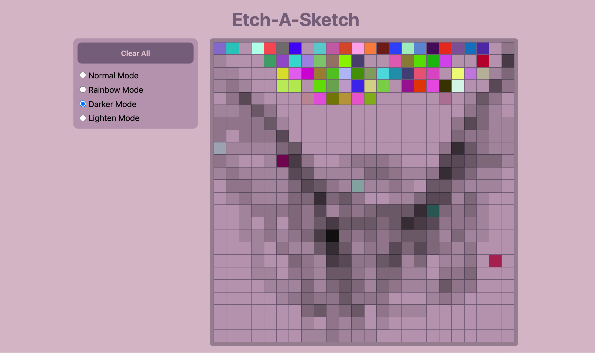
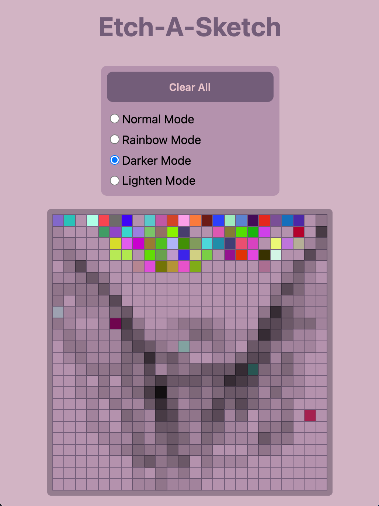

## Etch-A-Sketch

This project is for Odin Project fundamentals. It is meant to practice DOM manipulation skills.

## Things to note

* The grid was creating using CSS grid, and the template is adjusted via Javascript upon user input.
* The lightening and darkening functions use the filter property in CSS and adjust the brightness.
* When `forEach` is called, each of the squares stores variable of `brightness`, which is used to keep a reference to its brightness after darkening and lightening.
* A new grid removes all squares and populates the grid with new ones.
* It features a responsive layout by changing the `flex-direction` to `column` using media queries.
* Once the window becomes < 850px, the grid size begins to scale with the window size `vw` and `vh`.
* Flexbox was used to create a layout with controls on the left and the grid on the right.

## Screenshots
Desktop             |  Mobile
:-------------------------:|:-------------------------:
  |  

## To-do list
- [ ] Add a color picker to add single color
- [ ] Separate logic for clear board and creating new grid size
- [ ] Click and drag to draw instead of drawing on hover